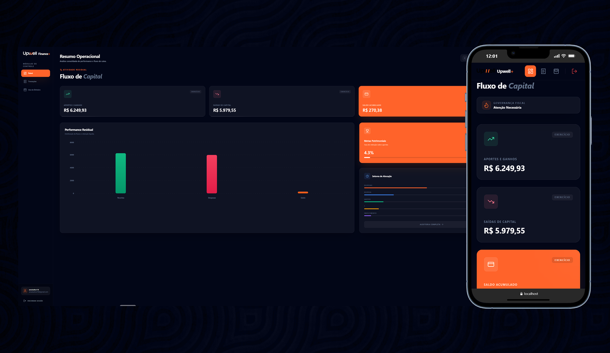
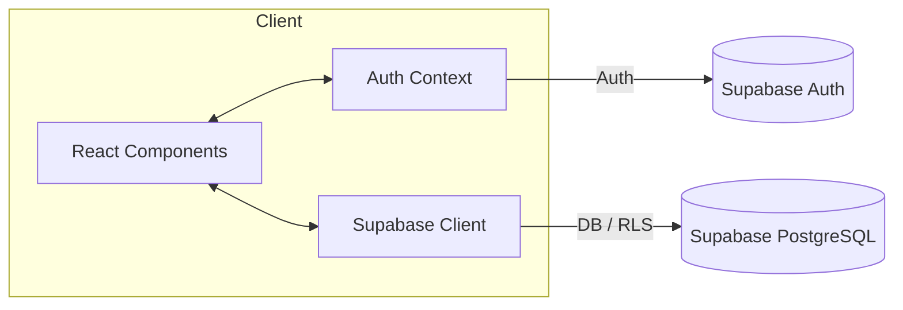

# Upwell Finance+

Plataforma premium de gestão financeira pessoal e corporativa, desenvolvida com React, TypeScript e Tailwind CSS. Foco em UX executive, controle de fluxo de caixa, potes de reserva patrimonial e importação inteligente de dados via Supabase.

<h1 align="center">
  
</h1>

## Funcionalidades

- 🌓 **Aesthetic Premium:** Interface dark mode com glassmorphism e animações suaves.
- 📊 **Dashboard de Performance:** Visão executiva dos ativos e passivos em tempo real.
- 📂 **Controle de Fluxo:** Gerenciamento de transações com filtros de competência mensal.
- 📥 **Importação Inteligente:** Motor de importação de arquivos CSV para extratos bancários.
- 🗄️ **Potes de Reserva:** Metodologia de segregação de capital com metas e progresso visual.
- 📈 **Gráficos Dinâmicos:** Monitoramento de absorção de capital via Recharts (Donut Charts).
- 🔐 **Autenticação Robusta:** Login e cadastro seguro via Supabase Auth integrado.
- 📱 **Totalmente Responsivo:** Experiência consistente em desktops, tablets e smartphones.
- 🗺️ **Layout Intuitive:** Sidebar persistente e navegação fluida por módulos de controle.

## Estrutura do Projeto

```txt
src/
├── components/                          # Componentes reutilizáveis
│   ├── landing/                         # Seções da Landing Page (Hero, Features, FAQ...)
│   ├── AuthGuard.tsx                    # Proteção de rotas autenticadas
│   ├── TransactionForm.tsx              # Widget de novos lançamentos
│   └── TransactionList.tsx              # Lista de transações com controle de status
├── pages/                               # Telas principais da aplicação
│   ├── LandingPage.tsx                  # Home institucional premium
│   ├── AuthPage.tsx                     # Portal de acesso e registro
│   ├── DashboardPage.tsx                # Visão geral financeira
│   ├── TransactionsPage.tsx             # Controle de Fluxo de Caixa
│   └── MoneyUsagePage.tsx               # Gestão de Potes (Uso do Dinheiro)
├── contexts/                            # Gerenciamento de estado (Auth Context)
├── helpers/                             # Formatadores (Moedas, Datas)
├── layouts/                             # Estruturas base (AppLayout com Sidebar)
├── lib/                                 # Configurações de clientes (Supabase)
├── types/                               # Definições globais de interfaces TypeScript
└── main.tsx                             # Ponto de entrada da aplicação Vite
```

## Arquitetura e Design

### Visão Geral

O Upwell Finance+ segue princípios de separação de responsabilidades (SoC), focando em performance de renderização e segurança de dados. O estado global é gerenciado via React Context API, enquanto a persistência e eventos de banco de dados são delegados ao Supabase.

### Fluxo de Dados



### Decisões de Design

1. **Design System "Executive Dark"**
   - Utilização de Tailwind CSS para consistência visual e glassmorphism.
   - Ícones Lucide React para clareza e minimalismo.
2. **Engenharia de Dados**
   - Supabase como Backend-as-a-Service para autenticação e banco de dados relacional.
   - Row Level Security (RLS) para garantir a privacidade total de cada usuário.
3. **Visualização de Ativos**
   - Recharts para tradução de dados brutos em insights visuais rápidos e interativos.
4. **Performance**
   - Bundling otimizado via Vite para carregamento instantâneo.
   - Memoização de cálculos financeiros pesados via `useMemo` e `useCallback`.

## Tecnologias Utilizadas

<div align="center">
  
  
  
  
  
  
  
</div>

> Core Tech Stack: Vite, React, TypeScript, Tailwind CSS, Supabase, Recharts, Lucide React, date-fns.

## Desenvolvedor

| Foto                                                                                                                             | Nome                                                 | Cargo                                                                                 |
| -------------------------------------------------------------------------------------------------------------------------------- | ---------------------------------------------------- | ------------------------------------------------------------------------------------- |
|  | [Jonatas Silva](https://github.com/JsCodeDevlopment) | Fullstack Software Engineer / CTO & Tech Lead at [PokerNetic](https://pokernetic.com) |

## Licença

Este projeto está sob a licença MIT. Veja o arquivo `LICENSE` para mais detalhes.

---

<div align="center">
  <sub>Built with ❤️ by <a href="https://github.com/JsCodeDevlopment">Jonatas Silva</a></sub>
</div>
